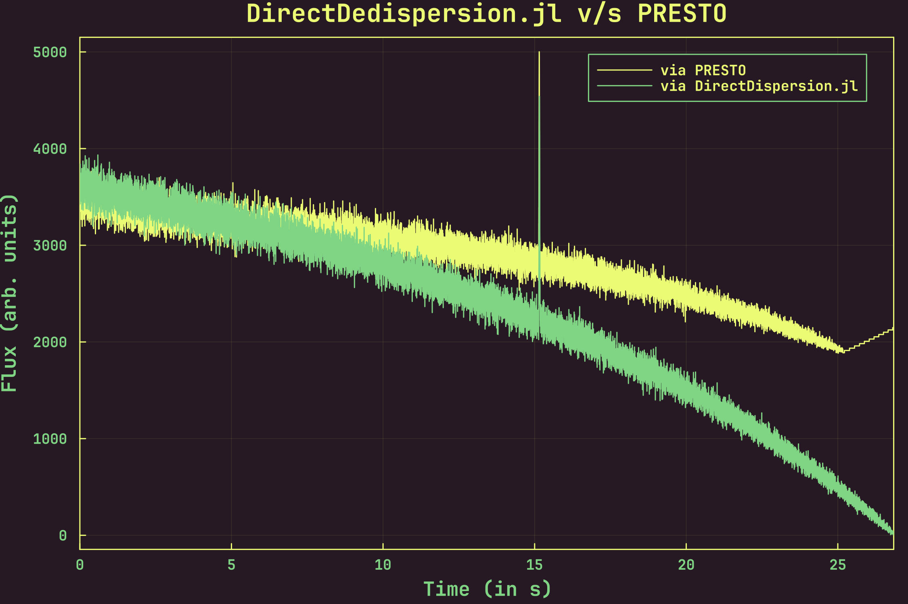

<div align="center">
<h1><code>DirectDedispersion.jl</code></h1>

![License][license]
![GitHub Stars][stars]
[![Gitmoji Badge][gitmoji_badge]][gitmoji]

<br/>
</div>

<div align="justify">

This package implements the **direct dedispersion algorithm** in pure Julia. Quoting from [**Barsdell et al. (2012)**](https://doi.org/10.1111/j.1365-2966.2012.20622.x):

> The direct dedispersion algorithm operates by directly summing frequency channels along a quadratic dispersion trail for each time sample and dispersion measure. In detail, the algorithm computes an array of dedispersed time series $D$ from an input data set $A$ according to the following equation: 
>$$\boxed{D_{d, t} = \sum_{\nu}^{N_{\nu}} A_{\nu, t + \Delta t(d, \nu)}}$$
>where the subscripts $d$, $t$ and $\nu$ represent dispersion measure, time sample and frequency channel, respectively, and $N_{\nu}$ is the total number of frequency channels.

Install it by typing and running:

```bash
] add DirecDedispersion
```

in the Julia REPL.


Here is an example of the same time series, obtained via [**`PRESTO`**][presto] and via `DirectDedispersion.jl`, from 30 seconds of data with a simulated FRB. The FRB has a DM of 1000 pc cm$^{-3}$, and an arrival time of 15 seconds[^1]:

<br/>



The simulation was carried out using the [**`simulateSearch`**](https://bitbucket.csiro.au/projects/PSRSOFT/repos/simulatesearch/browse) library, and is included in this package as a part of its testing suite [**here**](./test/data/frb.fil).

[^1]: The incline is due to the fact that the burst is present towards the end of the file, and the dispersion trail gets cut off. Hence, we end up summing less and less samples the closer we get to the end of the trail, leading to an odd incline. The same, but less steep, incline can be noticed in the `PRESTO` output.

</div>

[gitmoji]: https://gitmoji.dev
[presto]: https://github.com/scottransom/presto
[paper]: https://ui.adsabis.harvard.edu/abs/1995A%26A...300..707T/abstract
[gitmoji_badge]: https://img.shields.io/badge/gitmoji-%20😜%20😍-FFDD67.svg?style=for-the-badge
[stars]: https://img.shields.io/github/stars/astrogewgaw/DirectDedispersion.jl?style=for-the-badge
[license]: https://img.shields.io/github/license/astrogewgaw/DirectDedispersion.jl?style=for-the-badge
