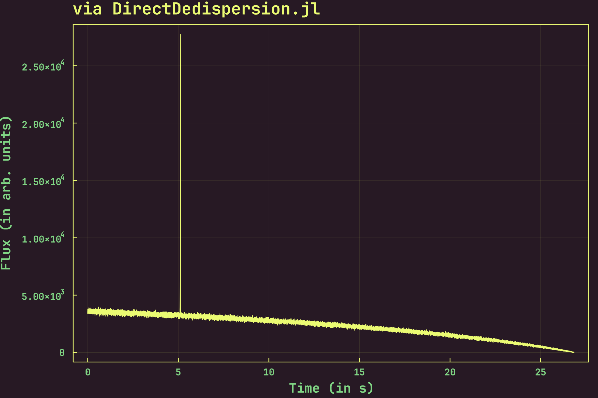

<div align="center">
<h1><code>DirectDedispersion.jl</code></h1>
<h4><i>Direct dedispersion, in Julia.</i></h4>
<br/>

![License][license]
![GitHub Stars][stars]
[![Gitmoji Badge][gitmoji_badge]][gitmoji]

<br/>
</div>

<div align="justify">

This package implements the **direct dedispersion algorithm** in pure Julia. Quoting from [**Barsdell et al. (2012)**](https://doi.org/10.1111/j.1365-2966.2012.20622.x):

> The direct dedispersion algorithm operates by directly summing frequency channels along a quadratic dispersion trail for each time sample and dispersion measure. In detail, the algorithm computes an array of dedispersed time series $D$ from an input data set $A$ according to the following equation: 
>$$\boxed{D_{d, t} = \sum_{\nu}^{N_{\nu}} A_{\nu, t + \Delta t(d, \nu)}}$$
>where the subscripts $d$, $t$ and $\nu$ represent dispersion measure, time sample and frequency channel, respectively, and $N_{\nu}$ is the total number of frequency channels.

Install it by typing and running:

```bash
] add DirectDedispersion
```

in the Julia REPL.

Here is an example of the same time series, obtained via `DirectDedispersion.jl` and [**`PRESTO`**][presto], respectively, from 30 seconds of simulated FRB data. The FRB has a DM of 1000 pc cm$^{-3}$, and an arrival time of 5 seconds:

<br/>

|   |   |
| - | - |
|  |  |

The incline in both plots is due to the fact that the DM of the simulated FRB is quite high, and the length of the file is low. Thus, we run out of samples to add as we go to lower frequency channels. The simulation was carried out using the [**`simulateSearch`**](https://bitbucket.csiro.au/projects/PSRSOFT/repos/simulatesearch/browse) library, and is included in this package as a part of its testing suite [**here**](./test/data/frb.fil). The plot from [**`PRESTO`**][presto] was obtained by using the following command: 

```bash
prepdata -dm 1000.0 -nobary -noclip frb.fil -o frb.dedisp
```

Note that the `-noclip` option is necessary for a fair comparison, since otherwise `PRESTO` performs a running mean on the time series, removing the incline seen above. Thus, we turn it off, obtaining the unprocessed dedispersed time series. As can be seen from the above plot, things seem to be working as expected 👍.

</div>

[gitmoji]: https://gitmoji.dev
[presto]: https://github.com/scottransom/presto
[gitmoji_badge]: https://img.shields.io/badge/gitmoji-%20😜%20😍-FFDD67.svg?style=for-the-badge
[stars]: https://img.shields.io/github/stars/astrogewgaw/DirectDedispersion.jl?style=for-the-badge
[license]: https://img.shields.io/github/license/astrogewgaw/DirectDedispersion.jl?style=for-the-badge
